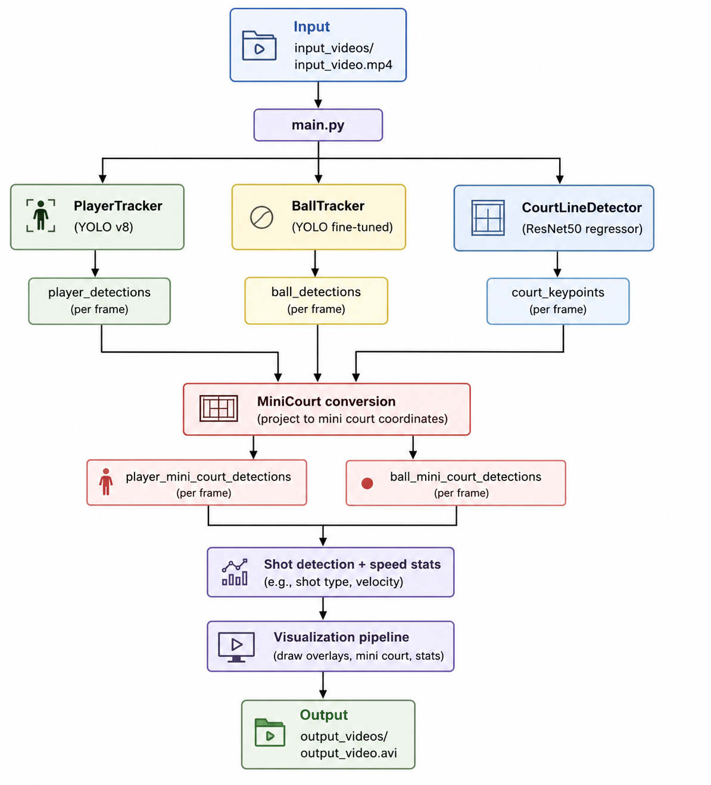
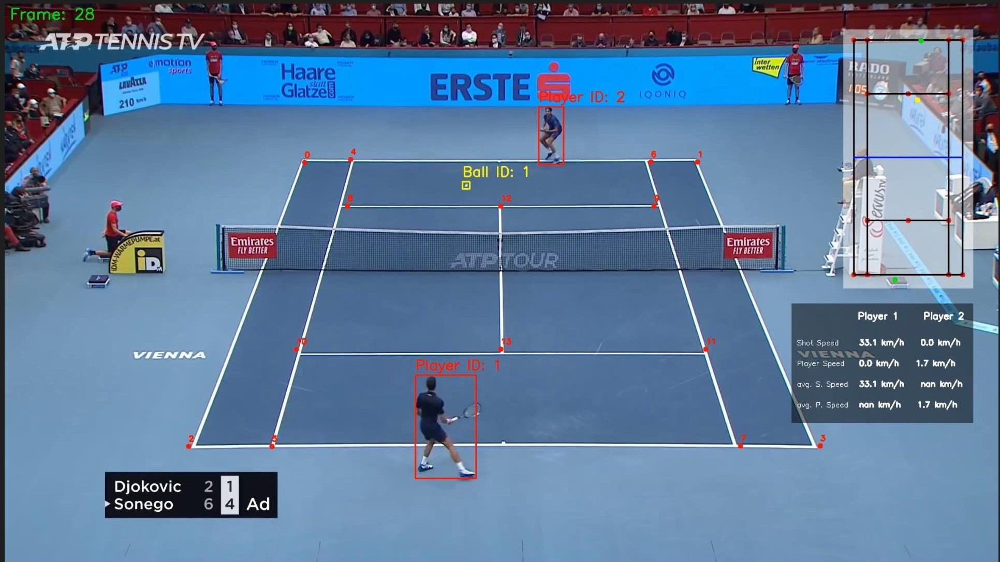

# Tennis Vision

## Overview
`Tennis Vision` is a computer vision pipeline for tennis match analytics. It processes video input to detect players and the ball, estimate court keypoints, compute shot and movement statistics, and generate annotated output video.

This repository is designed for rapid experimentation with sports analytics using YOLO-based detection, tracking, and court coordinate conversion.

## Features
* Player detection and tracking using YOLO
* Tennis ball detection with a fine-tuned YOLO model
* Court keypoint regression using a ResNet-based model
* Mini-court coordinate mapping for player and ball trajectories
* Shot segmentation, ball speed estimation, and player movement statistics
* Annotated output video with court overlays, bounding boxes, and performance metrics

## Architecture
The diagram below illustrates the core pipeline: video input is analyzed by player and ball trackers, court keypoints are estimated from the first frame, and all detections are mapped into a mini-court coordinate space for shot and movement analysis.



## Screenshot


## Quick Start
### 1. Create a virtual environment
```bash
make venv
```

### 2. Install dependencies
```bash
make install
```

### 3. Run the analysis pipeline
```bash
make run
```

### 4. Run YOLO inference helper
```bash
make infer
```

## Usage
The main analysis workflow is in `main.py`. By default, it reads input from:

* `input_videos/input_video.mp4`

and writes output to:

* `output_videos/output_video.avi`

Update these paths in `main.py` to use alternative videos or models.

## Project Structure
* `main.py` - primary analysis entry point
* `yolo_inference.py` - sample YOLO inference launcher
* `trackers/` - player and ball tracking modules
* `court_line_detector/` - court keypoint regression model
* `mini_court/` - court coordinate conversion and visualization
* `utils/` - video I/O, geometry helpers, and drawing utilities
* `training/` - model training notebooks and datasets
* `tracker_stubs/` - optional stubbed tracker outputs for fast iteration

## Models
* `yolov8x` for player detection
* `models/yolo5_last.pt` for tennis ball detection
* `models/keypoints_model.pth` for court keypoint regression

> Place custom model files in `models/` and update paths in `main.py` as needed.

## Training Resources
* `training/tennis_ball_detector_training.ipynb` - tennis ball detector training
* `training/tennis_court_keypoints_training.ipynb` - court keypoint model training

## Dependencies
* Python 3.8+
* `ultralytics`
* `opencv-python`
* `pandas`
* `numpy`
* `torch`
* `torchvision`

## Maintenance
* `make check` - syntax-check all Python sources
* `make clean` - remove generated outputs and caches
* `make clean-stubs` - remove tracker stub pickle files
* `make clean-all` - remove generated artifacts and `.venv`

## Notes
* Ensure your input video exists under `input_videos/` before running the pipeline.
* The current analysis assumes 24 FPS for ball speed computation.
* Adjust model paths in `main.py` when adding or replacing models.
